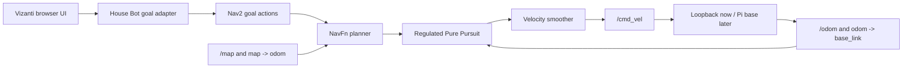

# Navigation and Browser UI

House Bot now has a hardware-independent ROS 2 Jazzy navigation runtime. It
uses Nav2 for planning and control, Nav2's loopback simulator in place of the
unfinished mobile base, and Vizanti for the browser UI. The loopback base is
removed—not rewritten—when the Pi motor/odometry adapter is ready.

## Run it

From Ubuntu WSL:

```bash
cd /home/james/Repos/house-bot
./run_navigation_ui.sh
```

The launcher builds and starts the pinned Docker environment, waits for the web
server, and opens [http://localhost:5000](http://localhost:5000) in Windows.
The first image build is large because it includes Nav2, RTAB-Map ROS, and the
Vizanti workspace.

Useful commands:

```bash
./run_navigation_ui.sh status
./run_navigation_ui.sh logs
./run_navigation_ui.sh test
./run_navigation_ui.sh stop
```

The `test` command runs the Python unit tests and then asks Nav2 to drive the
loopback base from Home to Kitchen. It fails unless the action succeeds and the
reported odometry finishes within 0.30 m of the named pose.

## UI controls

The supplied Vizanti layout opens with:

- the occupancy map, one-metre grid, transforms, odometry trail, and active
  Nav2 path;
- a point-goal tool that publishes a map pose and is converted to a
  `NavigateToPose` action;
- a waypoint tool converted to `NavigateThroughPoses`;
- Home, Kitchen, Office, and Lounge named-goal buttons;
- a Cancel button and a navigation-status inspector.

There is intentionally no teleoperation control in this stage. Navigation
goals exercise the planner/controller interface we need, while avoiding a
second manual-driving workstream before the motors exist.

Vizanti stores user layout changes in browser local storage. If an older local
layout hides the project defaults, use its settings reset or open the page in a
private window.

## Runtime boundary



The custom code does not plan paths. It only translates browser-friendly
topics and named services into official Nav2 actions and republishes compact
JSON status.

### Inputs expected from the real robot

The hardware launch uses the same navigation nodes but omits the loopback node.
The Pi/base integration must provide:

- `nav_msgs/msg/Odometry` on `/odom`;
- the `odom -> base_link` transform at the odometry update rate;
- metric wheel/base geometry consistent with the odometry;
- a localization source that provides `map -> odom` and an occupancy map on
  `/map`.

The base consumes `geometry_msgs/msg/Twist` on `/cmd_vel`. Current provisional
limits are 0.25 m/s linear speed and 0.8 rad/s angular speed. Robot radius is
provisionally 0.16 m; both values must be measured against the assembled base.

The current costmaps use the static occupancy map only. A depth-derived or
range-derived obstacle topic is the next perception input after metric scale
exists; it can be added as a Nav2 obstacle layer without changing the UI or
goal API.

## Named destinations

Mock-map destinations live in
`ros_ws/src/house_bot_navigation/config/destinations.yaml`. Each entry creates:

- a trigger service at `/house_bot/go/<name>`;
- an entry on the latched `/house_bot/destinations` JSON topic;
- a Nav2 goal when selected.

The generic `/house_bot/navigate_named` string topic remains available for
speech or AI behavior later. Replace the mock coordinates with recorded poses
from the first real metric map. Automatic room segmentation is not required
for the MVP; semantic room polygons can be layered onto the same destination
file after navigation works in the saved map.

## Mapping status

RTAB-Map ROS is installed in the container so its established occupancy-grid
and navigation workflow is available. It is not started in mock mode. The
single Logitech webcam and DPV-SLAM pose currently lack a trustworthy metric
depth/scale source, so starting an RGB-D mapper now would manufacture a map
contract the hardware cannot satisfy. Wheel odometry supplies metric motion;
the scheduled depth/point-cloud layer then supplies obstacle geometry.

## Important files

- `navigation/compose.yaml`: one-container development runtime.
- `navigation/Dockerfile`: pinned ROS base and Vizanti revision.
- `ros_ws/src/house_bot_navigation/launch/mock_navigation.launch.py`: map,
  loopback base, and shared navigation/UI launch.
- `ros_ws/src/house_bot_navigation/launch/navigation.launch.py`: real-base
  navigation/UI layer.
- `ros_ws/src/house_bot_navigation/config/nav2_params.yaml`: provisional small
  differential-base controller and costmaps.
- `ros_ws/src/house_bot_navigation/config/vizanti_layout.json`: project UI.
- `scripts/test_navigation_stack.sh`: unit plus end-to-end acceptance test.

