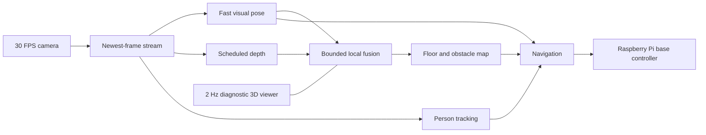

# House Bot Development Plan

**Plan status:** real-base calibration, 2026-08-20

**Repository:** `/home/james/Repos/house-bot` in Ubuntu WSL

## Objective

Build the shortest working path to a robot that maps its environment and
interacts with people. We start with SLAM on the development PC immediately.
Motor integration, ROS integration, navigation, and social behavior are added
to that working mapper instead of preceding it.

## MVP

The MVP is complete when:

1. a live camera stream produces a persistent navigation map and camera pose;
2. the mapper can close a loop through multiple rooms;
3. the camera can move from the PC to the Raspberry Pi/robot without changing
   the SLAM interface;
4. the wheeled base can localize in the map and navigate to named positions;
5. the robot can find a person, approach them, and perform one interaction.

## Architecture



The camera source is replaceable. Pose, depth, person perception, persistent
mapping, and visualization run independently so a slow dense product cannot
stall the robot control path. Phase 1 can use a file or a camera attached to
the PC. Later phases use the same image interface over the network from the
robot.

## Phase 1 - Establish the dense mapping baseline

### Target

Use MASt3R-SLAM as the first implementation because it produces monocular pose
and dense geometry from ordinary video. Run it standalone first; ROS is not a
prerequisite for proving the mapper. This phase establishes evidence and a
comparison baseline; it does not require MASt3R to remain the production
navigation tracker.

### Work

1. Create a Python 3.11 environment with a Blackwell-compatible PyTorch/CUDA
   toolchain for the RTX 5060 Ti.
2. Fetch a pinned MASt3R-SLAM revision and apply the required RTX 50-series
   compatibility changes.
3. Download the MASt3R checkpoints.
4. Run the upstream sample dataset.
5. Run a short Logitech recording from this house.
6. Add a generic live camera/stream input if upstream's input adapters do not
   accept the Logitech directly.
7. Save trajectory, reconstruction, timing, and failure information.

### Acceptance

- the sample dataset opens the live 3D visualization and completes;
- a Logitech room loop produces a recognizable reconstruction;
- current camera pose and accumulated geometry update while the camera moves;
- returning to the start produces a loop closure;
- the exact environment and run command are reproducible from this repo.

### Progress

- [x] Blackwell-compatible environment built and checked on the RTX 5060 Ti.
- [x] Pinned MASt3R-SLAM revision and local compatibility patches automated.
- [x] Upstream Freiburg room sample completed and saved a point cloud and pose
  trajectory.
- [x] Reference trajectory evaluated at 6.34 cm translation APE RMSE after
  alignment.
- [x] Windows C920 capture into WSL-visible MP4 and processing through SLAM
  verified.
- [x] Record and map a deliberate C920 room loop: 73 keyframes and 7.38 million
  colored points from a 60-second recording.
- [x] Confirm the interactive 3D viewer under WSLg.
- [x] Add continuous C920 input with a newest-frame TCP/PyAV adapter.
- [x] Diagnose the viewer/control-path contention using the user's moving run.
- [x] Repair and benchmark quarter-density pointmaps.
- [x] Limit the diagnostic full-map viewer to 2 Hz, restoring 7-8 FPS on the
  bounded visualized room run.

## Phase 1B - Select the production pose path

### Target

Use a sparse, loop-closing tracker for timely robot pose. Benchmark
DPVO/DPV-SLAM first on the existing room loop and live C920 stream. Keep
MASt3R-SLAM available for dense mapping and comparison.

### Work

1. Build a pinned DPVO/DPV-SLAM environment compatible with the RTX 5060 Ti.
2. Calibrate the fixed C920 camera used on the robot.
3. Run the same 60-second room recording and save trajectory/timing results.
4. Run the live newest-frame stream with visualization excluded from timing.
5. Measure throughput, latency, tracking loss, relocalization, and loop closure.
6. Select the pose backend from measured behavior, not reconstruction beauty.

### Acceptance

- sustained pose output is at least 15 Hz on the development PC;
- processing stays near current camera time instead of accumulating delay;
- the complete room loop remains connected and closes;
- pose throughput does not materially decline as the route grows;
- the result can consume the existing local and Pi camera interfaces.

### Progress

- [x] Pinned DPVO/DPV-SLAM environment built for RTX 5060 Ti `sm_120`.
- [x] Same 796-sample room loop benchmarked for DPVO, stock DPV-SLAM, fast
  DPV-SLAM, and the House Bot navigation profile.
- [x] Five-minute graph-growth test completed; selected profile sustained
  16.43 FPS overall and 15.78 FPS in the final partial window.
- [x] Production pose candidate selected: 96-patch DPV-SLAM with global
  optimization every 60 retained keyframes.
- [x] Replace the approximate FOV-derived intrinsics with a 29-view fixed-focus
  C920 calibration at 0.5706 px RMS reprojection error.
- [x] Connect the selected pose backend to the Pi's newest-frame H.264 stream;
  a stationary 150-sample transport smoke completed with bounded freshness.
- [x] Complete a moving 300-pose Pi-camera trajectory run at an effective
  16.96 Hz with 54 retained keyframes.
- [x] Complete a measured-calibration 1,000-pose route over 60.27 source
  seconds at 16.58 effective pose Hz with 154 retained keyframes.

### Depth gate

Do not add a depth network until the pose path passes. Then benchmark the
smallest temporally stable model that can supply local floor/obstacle geometry
at 5-10 Hz. Online Video Depth Anything is the first candidate, but its
relative depth needs a metric scale source such as wheel odometry. Persist a
bounded 5 cm-class voxel map rather than every predicted pixel from every
frame.

## Phase 2 - Live camera transport

Start with the Logitech because it is a predictable UVC source. Capture at the
PC first, then attach it to the Pi and transport the stream over Wi-Fi. SLAM
continues to consume the same URL/device abstraction.

Measure only what affects the end result:

- frame rate;
- end-to-end delay;
- dropped or reordered frames;
- reconnect behavior;
- image quality while moving.

### Wyze Cam Pan v2 branch

Evaluate the Wyze after the Logitech path maps successfully:

1. obtain a local stream on stock firmware;
2. expose local pan/tilt and night-mode control;
3. determine whether pan/tilt position can be read;
4. connect camera orientation to the SLAM pose model;
5. compare mapping quality and latency with the Logitech.

If the camera moves relative to the robot, its pan/tilt state must be included
in the camera pose. A simpler first mode is to stop the base, move the camera,
then resume with the new camera orientation registered.

### Acceptance

- swapping between local Logitech video and robot-streamed video requires only
  an input configuration change;
- the robot stream can map a multi-room walk without transport failure;
- the better camera path is selected from the resulting maps.

### Progress

- [x] Continuous Windows C920 stream maps through the common TCP/PyAV adapter.
- [x] WSL reverse-connect mode decodes a zero-transcode MJPEG camera server,
  matching the intended Pi-to-PC direction.
- [x] Pi-side FFmpeg sender and WSL-side Pi camera launcher added.
- [x] Power and discover the Raspberry Pi on the local network.
- [x] Attach the C920 to the Pi and complete a bounded robot-side stream run.
- [x] Verify 1280x720/30 native H.264 over Pi Wi-Fi and newest-frame drop
  behavior.
- [x] Move the Pi camera through a room route and save a live 300-pose
  DPV-SLAM trajectory.
- [ ] Measure reconnect behavior after an unplanned Wi-Fi interruption.

## Phase 3 - Put the mapper on wheels

Once the camera mapper works, integrate the Raspberry Pi and base.

### Work

- identify the platform's motor controller and encoders;
- implement left/right motor output and wheel feedback;
- create the robot coordinate frames and wheel geometry;
- publish camera pose relative to the robot;
- fuse wheel motion if it improves mapping/localization;
- add direct click/keyboard control for collecting robot-mounted SLAM runs.

### Acceptance

- the robot-mounted camera builds the same quality map as the handheld camera;
- the live robot pose remains located in the map through a room loop;
- a saved map can be loaded and the robot relocalizes within it.

### Progress

- [x] Define the real-base boundary as `/cmd_vel`, `/odom`, `odom -> base_link`,
  and `map -> odom`.
- [x] Stand up the complete Nav2 consumer side against the official loopback
  base while motors are unavailable.
- [x] Identify and deploy the Pi-controlled original-remote motor path, then
  verify forward, reverse, and both pivot directions.
- [x] Add a calibration-gated ROS base bridge with disarmed startup,
  stale-command and acknowledgement stops, open-loop odometry, and the measured
  camera transform boundary.
- [x] Record a conservative 6.5 x 6 in tread-base footprint and coarse,
  adjustable C920 transform at about 3 in forward and 6 in high.
- [x] Fit direction-specific full-power tread rates and effective skid-steer
  width.
- [x] Reject 50% pulse-density control after repeated routes usually activated
  only the left tread; keep the Pi endpoint binary full-power/stop by default.
- [ ] Determine whether the four-wire motors expose usable encoder feedback.
- [ ] Add a proportional motor driver and wheel feedback behind standard
  `ros2_control` differential-drive interfaces.
- [ ] Replace loopback with the Pi base adapter plus metric visual/encoder
  correction; do not use command-integrated odometry alone for autonomy.

## Phase 4 - Navigation in the SLAM map

Convert the SLAM geometry into a traversable floor/obstacle representation and
connect it to Nav2 or a smaller controller if that reaches the result faster.

### Work

- identify the floor and robot footprint;
- generate global and local obstacle layers;
- create named destinations;
- plan and execute paths in the reconstructed environment;
- expose the current map, pose, goal, path, and controller state.

### Acceptance

- the robot maps a test area and saves it;
- after restart it relocalizes in that map;
- it navigates between at least two named destinations;
- it replans around an obstacle introduced after mapping.

### Progress

- [x] Add a pinned ROS 2 Jazzy/Nav2 container without changing the WSL host.
- [x] Configure map server, NavFn planning, regulated pure pursuit control,
  velocity smoothing, behaviors, and waypoint actions for the small-base
  provisional geometry.
- [x] Add a deterministic mock house and hardware-free end-to-end navigation
  acceptance test.
- [x] Add the Vizanti browser map/pose/path/goal UI and named-room services.
- [ ] Replace mock destinations and geometry with measurements from the real
  base and first metric map.
- [ ] Add live obstacle geometry after wheel scale and depth are available.

## Phase 5 - Interact with people

Add person perception to the working mapped robot.

### Work

- detect and track people on the PC GPU;
- place tracks in the SLAM coordinate system;
- turn or pan to look at a selected person;
- navigate toward the person and maintain an interaction distance;
- add microphone, speaker, speech recognition, and speech output;
- implement the first complete behavior: find a person, approach, greet, and
  wait for a response.

### Acceptance

- a person remains tracked as the robot and person move;
- the robot can search mapped viewpoints for a person;
- the robot approaches, faces, and greets them;
- the external action trace is visible in the operator UI.

Completing Phases 1-5 is the MVP.

## After the MVP

- semantic room and object mapping;
- spatial memory and last-seen locations;
- active camera viewpoints and systematic exploration;
- following people between rooms;
- richer speech and AI tool use;
- docking and charging;
- a custom daily-use interface over the same SLAM/navigation state.

## Initial repository layout

```text
external/                   Fetched upstream projects; not committed
envs/                       Local dependency environments; not committed
scripts/                    Reproducible setup and run commands
patches/                    Local upstream compatibility patches
config/                     House Bot input and calibration configuration
data/input/                 Local videos and image sequences; not committed
data/output/                Maps, trajectories, and run artifacts; not committed
docs/                       Decisions, results, and project knowledge
```

## Development rules

- Optimize for the first end-to-end result.
- Do not add a preliminary subsystem unless the current result requires it.
- Keep the first SLAM run independent of ROS; integrate ROS after mapping works.
- Pin upstream revisions and dependency versions.
- Automate setup and run commands in this repo instead of relying on remembered
  terminal history.
- Keep checkpoints, environments, videos, and generated maps out of Git.
- When an experiment fails, record the exact error and fix the direct blocker.

## Immediate next actions

1. Identify the wheeled platform's motor driver and determine whether wheel
   encoders are present from labels, connectors, and photos.
2. Mount the fixed-focus C920 rigidly to the base, measure its transform, and
   repeat the calibrated route from a natural starting scene.
3. Add metric wheel observations to the selected DPV-SLAM pose path before
   treating monocular translation as navigation distance.
